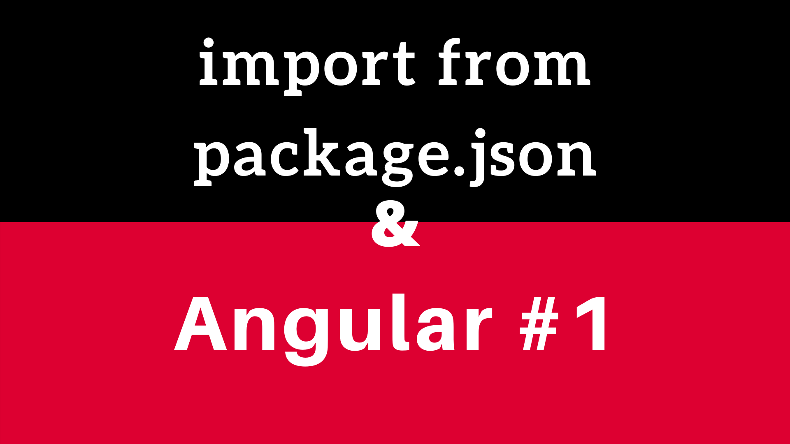

# Angular Tips #1 : Import package.json

## Comment récupérer des informations depuis le package.json au sein d'un projet Angular ? 

Effectivement, il peut être utile, de pouvoir traiter la version et/ou le nom de vôtre projet Angular. Afin de ne pas dupliquer les informations, il faut pouvoir les récupérer directement depuis le *package.json* à la racine de votre projet.

Afin d'importer ce type de fichier en TypeScript, il est nécessaire de modifier les options du "transpileur/compilateur" afin que les fichiers de ce type soit pris en compte.

Dans le fichier **tsconfig.json**, il faut ajouter l'option *resolveJsonModule* avec la valeur *true* 

``` javascript
  "compilerOptions": {
    "resolveJsonModule": true
  }
```

Après cette petite configuration, vous pouvez importer les proprietes directement depuis le fichier *package.json*

``` javascript
import {name, version} from '../../package.json';
```

## Ressources :
- https://www.typescriptlang.org/docs/handbook/compiler-options.html

- https://dev.to/daviddalbusco/get-app-name-and-version-in-angular-1co8